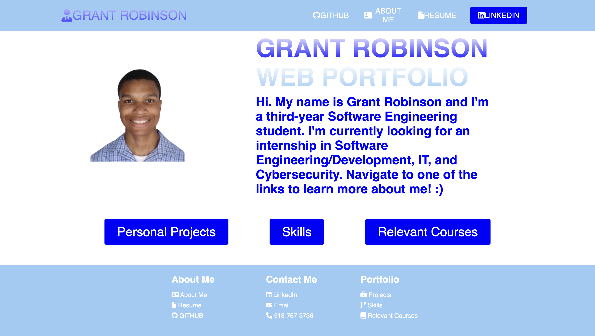
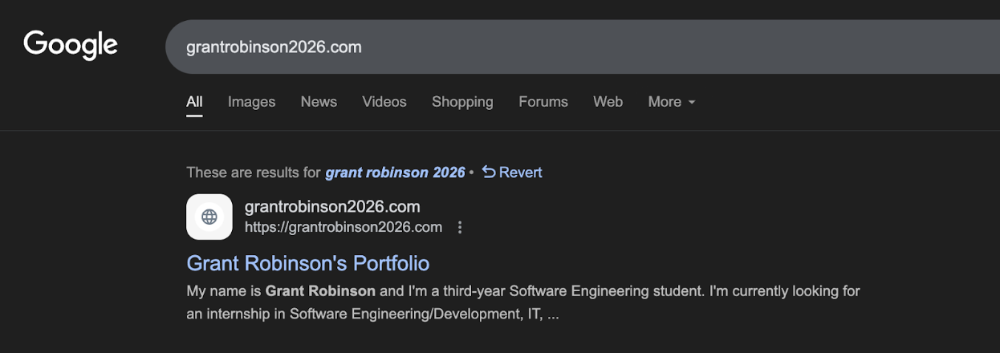

# Grant Robinson's Web Portfolio
This project is a portfolio that provides an overview of my experience as a Software Engineer. 
To showcase all of my work, I have my skills, projects, and University coursework delegated into
their appropriate sections.
## Languages Used
Markup Language:  
 
Styling:  
 
Animation for the Mobile Menu: 
 
## Challenge Faced

One challenge that I faced with this project was getting the text to mesh well with other elements (e.g. buttons). This problem is highlighted on desktop when adjusting the height and width of the website’s view. The same proportion problem can be seen on mobile (mainly a phone), especially when viewing the About Me screen. A resolution I found was using percentages for the height and width of elements in CSS. However, this issue still persists, so I will work to fix this problem as time goes on. 
 

## Directions for Use

1. To run this website, open any web browser and search <b>grantrobinson2026.com</b>. This should take you to the homescreen, which is pictured below.

2. If you typed in the URL and ended up on the search results page, then click on the link that says <b> Grant Robinson's Portfolio </b>. The picture below shows what the link should look like.

 

3. Enjoy the website! <b> Reminder: To go to the home screen from any other page, click on Grant Robinson in the top left corner of the screen. </b>

## Issues

<b> 1. Dimensions/proportions: </b> On a webpage, the buttons and text may overlap with each other as well as the images based on the height/width of the webpage at the time of use. Zooming in and out of the page, and adjusting the height and width of the window can cause this issue. For the best viewing experience, my recommendation is to use the default view when loading up this website.
 

<b> 2. Home Buttons: </b> The buttons on the home page may not respond to clicks on the first try. My recommendation is to hover off of the button for a second and then try to click it.

 

## Credits

- <a href="https://youtu.be/FazgJVnrVuI?si=KZ6NhcFTK0Y-JomD" target="_blank" rel="noopener noreferrer"> 
    Brian Design 
    </a>
for an HTML website tutorial
- <a href="https://youtu.be/p1QU3kLFPdg?si=00TxZshK-RGiIpdv" target="_blank" rel="noopener noreferrer"> 
    SuperSimpleDev 
    </a>
for helping me get this website on the internet
- <a href="https://youtu.be/qYoc07Da6kg?si=QFYSvdlVFVlTdkmt" target="_blank" rel="noopener noreferrer"> 
CWM - Coding With Mike 
    </a>
for helping me get my project on Github